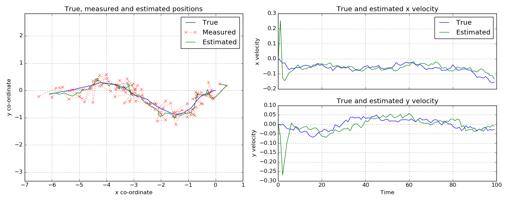

Starman: Kalman filtering for Python
====================================

Features
--------

Kalman filtering
````````````````



A Kalman filtering implementation allows you to estimate the state of any linear
system in the presence of noise.

Copyright and licensing
-----------------------

See the `LICENCE.txt <LICENSE.txt>`_ file in the repository root for details.
tl;dr: MIT-style.

Why "starman"?
--------------

Starman implements the Kalman filter. The Kalman filter was used for trajectory
estimation in the Apollo spaceflight programme. Starman is thus a blend of
"star", signifying space, and "Kalman". That and "kalman" was already taken as a
package name on the PyPI.

